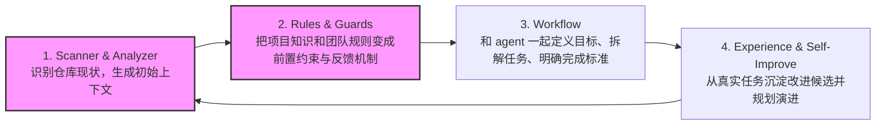

# HarnessKit 阶段汇报：构建可控的 Agent 研发护栏

## 一、项目摘要 (Executive Summary)

* **核心定位**：帮助不够 AI Native 的传统研发团队极低成本地在仓库中构建和维护一套面向 Agent 友好的 Context Harness（上下文脚手架），解决“冷启动不知如何编写”与“项目演进导致上下文陈旧漂移”的开发失败问题。
* **当前进展**：已跑通 **“仓库scanner/analyzer(收集分析, 中间物) -> rules定义 -> 自动化 Guard -> ~~pre-commit 拦截~~”** 的 MVP 全闭环。实测可自动拦截“开发配置变化但 Agent 文档未同步更新”的漂移风险。
- [ ] 试着思考客户不用git的场景, 别的版本控制工具
- [ ] 理想的agent.md & arch.md, 具体要包括什么
* **下阶段重点**：完善 Repository Map 自动测绘，并实现 Linter Issue Code 的标准化映射，为后续的工作流组装（Workflow）打好底座。

---

## 二、核心交付物与业务价值 (Key Deliverables & Value)

目前我们已沉淀了一套轻量、开箱即用的 Harness 原型，并在当前仓库完成自举验证：

1. **统一的 Agent 入口契约 ([AGENTS.md](../AGENTS.md) / [ARCHITECTURE.md](../ARCHITECTURE.md))**
   * **价值**：将仓库结构、验证入口、本地 Skills 固化为标准文档。新 Agent 进场无需全量扫描或人肉答疑，实现“首屏即用”。
   - [ ] 这也是rules的一部分.
2. **确定性反馈工具链 (Harness Linter POC)**
   * **价值**：实现对配置、Markdown 链接、Marker 结构、技术栈及验证命令漂移的静态检查。
   - [ ] rules, 包括什么(不考虑别的skills, 也不考虑skills的触发, 行业的最佳实践, code style, naming style, 可以读到现状(驼峰 etc...))
   - [ ] guard
    - [ ] 包括测试, 但是我们可以探测出来什么测试缺失, 在什么方向补测试价值最高. coverage summary. 
    - [ ] 优先考虑客户的开发场景.
    - [ ] 文档 优先级 低于代码, 或者我们认为代码是事实来源.
    - [ ] 不要擅自改对齐过的
    - [ ] Claude code init. 
3. **研发链路自动化防护 (pre-commit 集成)**
   * **价值**：**典型场景验证成功** —— 当技术栈/构建脚本发生实质变化，而 Agent 说明文档未更新时，pre-commit 自动触发 Linter 报错并阻止 Git 提交，实现物理层面的“防漂移闭环”。

   

---

## 三、产品定义与边界划定 (Scope & Alignment)

### 1. 核心定位与痛点
我们要解决的核心痛点包含两层：
1. **认知与冷启动障碍（AI Native 转型第一步）**：不够 AI Native 的团队不知道、也写不出一套能让 Agent 稳定理解项目（Agent-friendly）的上下文资产。
2. **维护与防腐烂难题（演进防护）**：即便人肉整理了一套上下文说明，随着项目的日常迭代，这套上下文资产也会因高昂的人力同步成本而迅速发生漂移、分叉与腐烂。

HarnessKit CLI 作为**脚手架工具**的本质价值是：
* **初始化时**：一键为传统仓库套用标准的 Agent 契约模型（[AGENTS.md](../AGENTS.md) / [RULES.md](../RULES.md) / Skills / Validations 最佳实践），解决“怎么写”的冷启动问题。
* **演进过程中**：通过 Scanner 自动提取事实，并通过 Linter / Guard 提供静态防腐拦截，解决“如何维护”的防漂移问题。

### 2. 项目边界（Out of Scope）
为保证聚焦，HarnessKit 当前不涉及以下非本阶段目标的层次：
* **Agent 运行时**：不实现 Agent Loop、沙箱、权限控制或模型调度。
* **编排与调度层**：不做多 Agent 编排、任务队列或 DAG 管理。
* **质量与工程平台**：不替代已有的 Ruff、pytest 等工程工具，而是通过规则对其进行关联和路由。

---

## 四、技术路径与演进路线图 (Technical Roadmap)

完整问题域构成一个持续循环，当前我们采取 **“分步演进、先防护后演化”** 的策略：

*(注：粉色高亮部分 A、B 为当前 MVP 核心交付范围，其余为 Phase 2/3 演进方向)*

### Phase 1：坐标系与确定性护栏 (MVP - 当前聚焦)

#### 1. Scanner & Analyzer (建立坐标系)
- [x] **Stack & Context Scan**
   - **技术栈事实**：识别语言、包管理器、构建工具、测试框架、lint/format 工具。
   - **验证入口**：识别当前仓库已经存在的测试、构建、lint、pre-commit 等可执行检查。
   - **现有上下文资产**：识别已有的 [AGENTS.md](../AGENTS.md)、[CLAUDE.md](../CLAUDE.md)、skills、README、架构文档和其他 agent-facing 文档。
   - **当前状态**：已收敛为 $scan-facts 加后续 fill skills。
- [ ] **Repository Map**
   - **仓库结构地图**：识别主要目录、关键文件和入口位置。
   - **当前状态**：MVP 待补齐，当前 [ARCHITECTURE.md](../ARCHITECTURE.md) 已作为静态底座。
- [ ] **Risk Signals**
   - **初始风险点**：发现断链、缺失文件、过期验证命令、placeholder、未成对 marker 等确定性问题。
   - **当前状态**：暂不纳入 MVP，后续可作为 guard/audit 能力扩展。
- [ ] 要有一个交互的过程. override的情况也要考虑, 还是要有一个mcp的交互
- [ ] 不要做大而全, 就做rules需要的信息, rules是消费者. 
- [ ] 具体的rules / guard 的内容, 最佳实践. 

#### 2. Rules & Guards (规则与自动化防漂移)
- [x] **Harness 资产完整性规则**
   - [AGENTS.md](../AGENTS.md) 和 [CLAUDE.md](../CLAUDE.md) 必须存在且非空。
   - [.harnesskit/config.json](../.harnesskit/config.json) 必须存在、JSON 合法，并符合当前 schema 和 integration 约束。
   - 已安装的 Codex integration 必须具备对应本地 skills。
- [x] **Agent 入口与 skill 路由规则**
   - [CLAUDE.md](../CLAUDE.md) 应指向 [AGENTS.md](../AGENTS.md)，避免多份入口说明漂移。
   - [AGENTS.md](../AGENTS.md) 中引用的 `$skill` 必须真实存在于 [.agents/skills/](../.agents/skills/)。
   - 每个 skill 文件必须具备 `name` 和 `description` frontmatter。
- [x] **Markdown 与 marker 结构规则**
   - 本地 Markdown 链接必须指向真实存在的文件。
   - `harnesskit:todo-checklist`、`harnesskit:tech-stack`、`harnesskit:verification` marker 必须成对。
   - 占位说明不能长期残留在架构说明中。
- [x] **Repository Map 规则**
   - [ARCHITECTURE.md](../ARCHITECTURE.md) 中声明的路径必须真实存在。
   - 使用 `harnesskit:coverage=direct-children` 时，目录的直接子项必须被文档覆盖，或显式 ignore。
   - coverage hint 必须使用合法语法。
- [x] **Tech Stack Drift 规则**
   - 文档中的技术栈块必须和仓库事实一致。
   - 包管理器、测试框架、构建后端、CLI 框架等不能和 [pyproject.toml](../pyproject.toml)、lockfile、测试目录等证据冲突。
- [x] **Verification Drift 规则**
   - 如果仓库事实表明使用 `pytest`，agent-facing 文档不能继续要求 `unittest`。
   - 如果仓库声明了 Ruff，验证契约必须记录 Ruff lint。
   - 如果配置了 Ruff formatter，验证命令必须是 check-only，不应使用会修改文件的 format 命令。
   - 如果存在 package build 或 pre-commit 配置，验证契约必须记录对应 gate，或显式说明 inactive。
- [ ] **Rule-to-Guard Mapping**
   - 下一步需要把上述 rules 映射到 linter issue code，例如 `skill.reference.missing`、`architecture.coverage_missing`、`verification.stale_test_framework`。
   - 映射表应标注 severity、检查方式和是否属于 MVP。
- [ ] **Promotion Path**
   - 当前 linter 仍是 [harness-linter-poc/](../harness-linter-poc/)。
   - 后续需要决定哪些 guard 进入正式 HarnessKit CLI、pre-commit 或 CI 集成。

---

### Phase 2：任务澄清与自主演进 (长期规划)

#### 3. Workflow (任务定义与拆解)
- [ ] **目标澄清**
   - 把用户的自然语言意图转成明确目标。
   - 明确这次任务要解决什么、不解决什么。
   - 标出需要用户确认的开放问题。
- [ ] **范围定义**
   - 明确涉及哪些模块、文档、配置和测试。
   - 明确哪些边界不能动，例如兼容性、公开 API、模板输出或数据格式。
   - 把“可能顺手做的事”排除出当前任务。
- [ ] **任务拆解**
   - 把任务拆成可执行步骤。
   - 标出步骤之间的依赖关系。
   - 为每一步关联需要读取的上下文和可能触发 Bay rules/guards。
- [ ] **完成标准**
   - 定义任务完成时应该看到什么结果。
   - 明确需要运行哪些验证命令。
   - 明确哪些结果需要用户或 reviewer 再确认。
- [ ] **Repair Loop**
   - 当 guard 或测试失败时，定义 agent 应该如何回到前一步修复。
   - 区分自动可修复的问题和需要人工决策的问题。
   - 保留失败证据，避免 agent 反复尝试同一种无效修复。

#### 4. Experience Memory & Harness Evolution (经验记忆与上下文自演进)
- [ ] **Experience Memory**
   - 从真实任务中记录可复用经验：有效命令、反复出现的问题、误导 agent 的旧规则、缺失的验证入口、需要补充的项目事实。
   - 区分短期任务记录和长期稳定记忆：短期内容先进入 [RULES.md](../RULES.md) 的待确认项或任务记录，反复验证后再沉淀到 [AGENTS.md](../AGENTS.md)、skills、架构文档或 guard。
   - 可参考 OpenClaw 的 memory 思路：把长期事实、偏好、决策和每日运行记录放进可读、可编辑的文件，而不是只留在对话上下文里。
- [ ] **Improvement Evaluation**
   - 对候选改进建立评估门槛：它解决了什么失败模式、影响哪个 skill/rule/guard、是否有验证方式、是否值得进入默认模板。
   - 可参考 SkillOpt 的思路：把 skill 当作可演化文本资产，通过任务轨迹、反思、受限编辑和验证门来决定是否接受改动。
   - 可参考 Self-Harness 的思路：从执行轨迹中挖掘 weakness，提出最小 harness 修改，再用验证阶段筛选候选。
- [ ] **Maturity Planning**
   - 定期回看 Scanner、Rules、Guards、Workflow 和 Experience Memory 的覆盖情况。
   - 判断哪些能力已经稳定到可以进入模板/CLI，哪些还应停留在 POC、candidate 或人工流程中。

---

## 五、后续计划与关键节点 (Next Steps)

1. **规范化打包**：将校验逻辑整合入 HarnessKit 核心 CLI，提供一致的命令行体验。
2. **度量指标建立**：在后续仓库接入中，量化接入 Harness 后 Agent 开发任务的“首次成功率”与“人肉排错耗时”。
3. **沉淀规范模板**：固化 Codex 等主力 Integration 模板，确保新初始化仓库能直接继承最新的研发契约。

drift -> suggestions? nope.
- [ ] code, docs, brain? who is the source of turth? , 这部分还是要问人, confuse

怎么引导agent总能注意到?
skills -> sop ? tricks ?

没有最正确的skills.

- [ ] 组织level的上下文. ?

latent context.

mbti ?

防腐也要用户确认.
