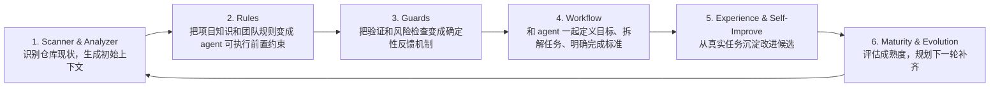

# HarnessKit 阶段汇报

## 1. 定义：我们现在做的是什么

我们要解决的是：**agent 在进入一个具体仓库时，如何获得稳定、可维护、不会随项目演进而腐烂的项目上下文。**, 长期看, 这个上下文会越来越准, 但是自进化不是当前目标

### HarnessKit 当前在做什么

当前阶段要做的是把一个仓库变成 agent 更容易稳定工作的环境：

- **建立坐标系**：扫描仓库事实，让 agent 知道项目结构、技术栈、测试和构建入口。
- **沉淀上下文**：把项目规则、入口文档、skills、架构地图和验证契约放进仓库。
- **提供可读入口**：让 agent 不需要每次重新问人，也能从 `AGENTS.md`、skills 和相关文档开始工作。
- **安装确定性 guard**：用 lint、测试、链接检查和 pre-commit hook 检查上下文是否和仓库事实对齐。
- **防止上下文漂移**：当工具链、文件结构或验证流程变化时，及时发现 agent-facing 文档没有同步更新的问题。
- **Workflow Builder**：长期看属于同一问题域，但不是当前阶段；当前不负责把某个具体任务拆成步骤，也不决定 agent 下一步应该做什么。

### HarnessKit 不包括什么

先用排除法划边界。HarnessKit 当前不包括：

- **Agent Runtime**：不实现 agent loop、工具调用、沙箱、权限控制或模型调度。
- **Orchestration / Controller**：不做多 agent 编排、任务队列、DAG 调度或长期任务管理。
- **业务需求系统**：不替团队定义需求、优先级、产品方案或验收标准。
- **代码质量平台**：不替代 Ruff、pytest、SwiftLint、CI 等已有工程工具。

### 完整问题域的循环

### 1. Scanner & Analyzer

Scanner & Analyzer 的目标是先建立项目坐标系。它不急着给 agent 下规则，而是先回答：这个仓库现在客观上是什么样子。

这一阶段的产出包括：

- [x] **Stack & Context Scan**
   - **技术栈事实**：识别语言、包管理器、构建工具、测试框架、lint/format 工具。
   - **验证入口**：识别当前仓库已经存在的测试、构建、lint、pre-commit 等可执行检查。
   - **现有上下文资产**：识别已有的 `AGENTS.md`、`CLAUDE.md`、skills、README、架构文档和其他 agent-facing 文档。
   - **当前状态**：已收敛为 `$scan-stack` skill。

- [ ] **Repository Map**
   - **仓库结构地图**：识别主要目录、关键文件和入口位置。
   - **当前状态**：MVP 待补齐. ARCHITECTURE.md已经定义好了

- [ ] **Risk Signals**
   - **初始风险点**：发现断链、缺失文件、过期验证命令、placeholder、未成对 marker 等确定性问题。
   - **当前状态**：暂不纳入 MVP，后续可作为 guard/audit 能力扩展。

这一阶段的关键价值是：先把仓库事实测绘出来，避免后续 Rules、Guards 和 Workflow 建在猜测上。

### 2. Rules & Guard

Rules & Guard 的目标是把仓库事实转成 agent 可执行的规则，并为稳定规则建立对应检查。这里的核心原则是：**Rule 和 Guard 应该可追踪地对应**。Rule 说明 agent 应该遵守什么，Guard 说明如何发现这条规则失效、漂移或被违反。

当前已经不是空白状态。`harness-linter-poc/` 已经沉淀了一批可执行 guard，也意味着这些 rules 已经有了雏形：

- [x] **Harness 资产完整性规则**
   - `AGENTS.md` 和 `CLAUDE.md` 必须存在且非空。
   - `.harnesskit/config.json` 必须存在、JSON 合法，并符合当前 schema 和 integration 约束。
   - 已安装的 Codex integration 必须具备对应本地 skills。

- [x] **Agent 入口与 skill 路由规则**
   - `CLAUDE.md` 应指向 `AGENTS.md`，避免多份入口说明漂移。
   - `AGENTS.md` 中引用的 `$skill` 必须真实存在于 `.agents/skills/`。
   - 每个 `SKILL.md` 必须具备 `name` 和 `description` frontmatter。

- [x] **Markdown 与 marker 结构规则**
   - 本地 Markdown 链接必须指向真实存在的文件。
   - `harnesskit:todo-checklist`、`harnesskit:tech-stack`、`harnesskit:verification` marker 必须成对。
   - 占位说明不能长期残留在架构说明中。

- [x] **Repository Map 规则**
   - `ARCHITECTURE.md` 中声明的路径必须真实存在。
   - 使用 `harnesskit:coverage=direct-children` 时，目录的直接子项必须被文档覆盖，或显式 ignore。
   - coverage hint 必须使用合法语法。

- [x] **Tech Stack Drift 规则**
   - 文档中的技术栈块必须和仓库事实一致。
   - 包管理器、测试框架、构建后端、CLI 框架等不能和 `pyproject.toml`、lockfile、测试目录等证据冲突。

- [x] **Verification Drift 规则**
   - 如果仓库事实表明使用 `pytest`，agent-facing 文档不能继续要求 `unittest`。
   - 如果仓库声明了 Ruff，验证契约必须记录 Ruff lint。
   - 如果配置了 Ruff formatter，验证命令必须是 check-only，不应使用会修改文件的 format 命令。
   - 如果存在 package build 或 pre-commit 配置，验证契约必须记录对应 gate，或显式说明 inactive。

- [ ] **Rule-to-Guard Mapping**
   - 下一步需要把上述 rules 映射到 linter issue code，例如 `skill.reference.missing`、`architecture.coverage_missing`、`verification.stale_test_framework`。
   - 映射表应标注 severity、检查方式和是否属于 MVP。

- [ ] **Promotion Path**
   - 当前 linter 仍是 `harness-linter-poc/`。
   - 后续需要决定哪些 guard 进入正式 HarnessKit CLI、pre-commit 或 CI 集成。

### 3. Workflow：任务定义与拆解

Workflow 这一层要解决的不是“agent 怎么运行”，而是“人和 agent 如何把一个模糊任务变成可执行、可验证的任务说明”。它更接近 Spec Kit / Superpowers 这类能力：帮助用户和 agent 一起澄清目标、拆解路径、定义完成标准。

这一阶段的职责包括：

- [ ] **目标澄清**
   - 把用户的自然语言意图转成明确目标。
   - 明确这次任务要解决什么、不解决什么。
   - 标出需要用户确认的开放问题。

- [ ] **范围定义**
   - 明确涉及哪些模块、文档、配置和测试。
   - 明确哪些边界不能动，例如兼容性、公开 API、模板输出或数据格式。
   - 把“可能顺手做的事”排除出当前任务。

- [ ] **任务拆解**
   - 把任务拆成可执行步骤。
   - 标出步骤之间的依赖关系。
   - 为每一步关联需要读取的上下文和可能触发的 rules/guards。

- [ ] **完成标准**
   - 定义任务完成时应该看到什么结果。
   - 明确需要运行哪些验证命令。
   - 明确哪些结果需要用户或 reviewer 再确认。

- [ ] **Repair Loop**
   - 当 guard 或测试失败时，定义 agent 应该如何回到前一步修复。
   - 区分自动可修复的问题和需要人工决策的问题。
   - 保留失败证据，避免 agent 反复尝试同一种无效修复。

当前阶段暂不实现 Workflow Builder。它应该建立在 Scanner 提供的仓库事实、Rules 提供的前置约束、Guards 提供的反馈机制之上。换句话说，Workflow 是后续层：先有坐标系和护栏，再讨论如何画任务路径。

### 4. Experience Memory & Harness Evolution

这一阶段处理的不是单次任务执行，而是：真实任务结束后，哪些经验应该留下来，哪些候选改进值得进入下一轮 harness 更新。

- [ ] **Experience Memory**
   - 从真实任务中记录可复用经验：有效命令、反复出现的问题、误导 agent 的旧规则、缺失的验证入口、需要补充的项目事实。
   - 区分短期任务记录和长期稳定记忆：短期内容先进入 `candidate.md` 或任务记录，反复验证后再沉淀到 `AGENTS.md`、skills、架构文档或 guard。
   - 可参考 OpenClaw 的 memory 思路：把长期事实、偏好、决策和每日运行记录放进可读、可编辑的文件，而不是只留在对话上下文里。

- [ ] **Improvement Evaluation**
   - 对候选改进建立评估门槛：它解决了什么失败模式、影响哪个 skill/rule/guard、是否有验证方式、是否值得进入默认模板。
   - 可参考 SkillOpt 的思路：把 skill 当作可演化文本资产，通过任务轨迹、反思、受限编辑和验证门来决定是否接受改动。
   - 可参考 Self-Harness 的思路：从执行轨迹中挖掘 weakness，提出最小 harness 修改，再用验证阶段筛选候选。

- [ ] **Maturity Planning**
   - 定期回看 Scanner、Rules、Guards、Workflow 和 Experience Memory 的覆盖情况。
   - 判断哪些能力已经稳定到可以进入模板/CLI，哪些还应停留在 POC、candidate 或人工流程中。
   - 当前状态：后续阶段，MVP 只需要保留清晰入口和候选池，不急于自动化 self-improvement loop。

### 当前已经完成的交付物

这一阶段已经完成的不是完整产品，而是一组可以证明方向成立的 Context Harness 原型：

- [x] **`AGENTS.md`**
   - 作为 agent 进入仓库的主入口。
   - 记录仓库结构、触发本地 skills 的条件、验证栈、开发工作流和注意事项。
   - 目标是让 agent 不需要每次重新询问项目背景。

- [x] **`ARCHITECTURE.md`**
   - 作为粗粒度仓库地图。
   - 记录主要目录和关键文件。
   - 已引入 `harnesskit:coverage=direct-children`，让 linter 可以检查架构地图是否遗漏直接子项。

- [x] **本地 Skills**
   - 已有验证、实现策略、PR 草稿等本地 skills。
   - skills 把常见操作流程从一次性对话中沉淀成可复用的 agent 工作方式。
   - 后续 scanner / refresh / audit 类能力也可以沿用这个形态。

- [x] **Harness Linter POC**
   - 已实现 `harness-linter-poc/`，作为确定性 guard 的原型。
   - 能检查 harness 配置、核心文件、skill frontmatter、skill 引用、Markdown 链接、marker 配对、architecture coverage、tech stack drift 和 verification drift。
   - 当前 linter 已经能发现“仓库事实变化但 agent-facing 文档没有更新”的问题。

- [x] **pre-commit 自举验证**
   - 已把 linter 接入 Git pre-commit。
   - 实测当新增 `pre-commit` 配置但验证文档未更新时，linter 能报错并阻止提交。
   - 文档补齐后，pre-commit 全部通过，说明 guard 闭环已经跑通。
